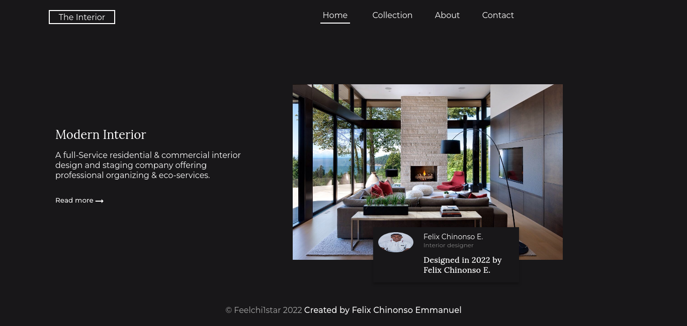
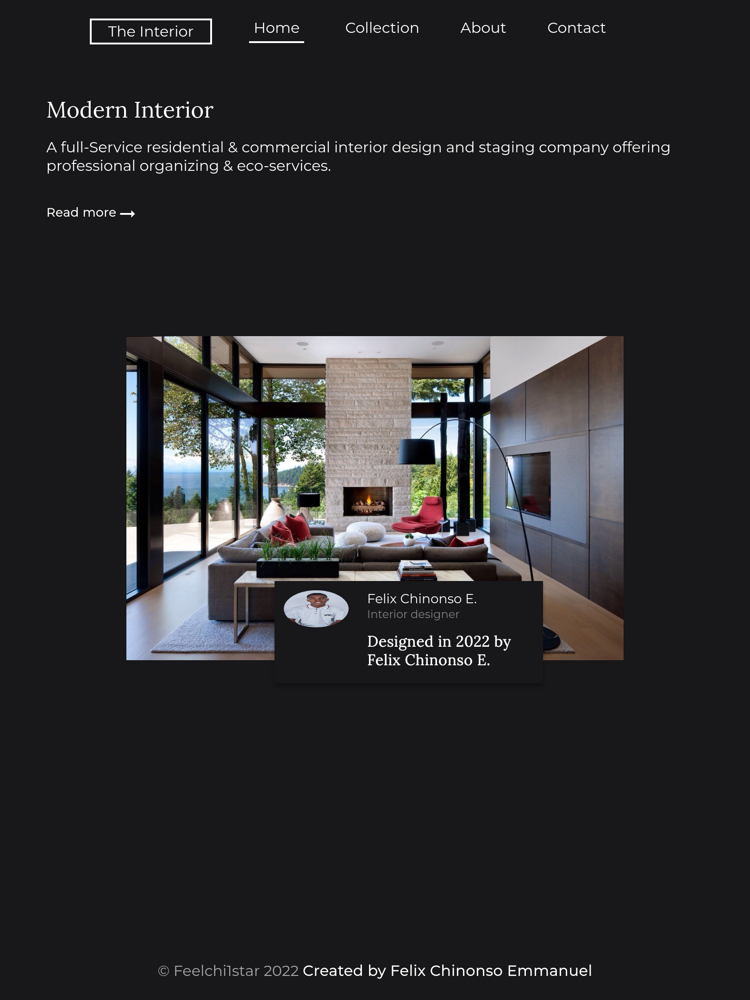
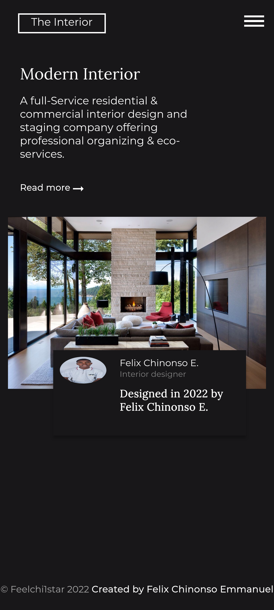

<h1 align="center">INTERIOR CHALLENGE</h1>

   Solution for a challenge from  <a href="http://devchallenges.io" target="_blank">Devchallenges.io</a>.

  <h3>
    <a href="https://feel-Interior.netlify.app/">
      Demo
    </a>
     | 
    <a href="https://github.com/feelchi1star/Interior-Consultant.git">
      Solution
    </a>
     | 
    <a href="https://devchallenges.io/challenges/wBunSb7FPrIepJZAg0sY">
      Challenge
    </a>
  </h3>

## Table of Contents

- [Overview](#overview)
  - [Built With](#built-with)
- [Features](#features)
- [Contact](#contact)
- [Acknowledgements](#acknowledgements)

## Overview

### Desktop View

### Table View

### Mobile View

- Where can I see your demo?
  You see my demo at -[INTERIOR CONSULTANT CHALLENGE](https://feel-Interior.netlify.app/)
- What was your experience?
  My exprience was really intermediate.
- What have you learned/improved?
  I really improved on my knowledge on Media Query to target different devices with breakpoints.

### Built With

- [HTML](https://html.org/)
- [CSS](https://w3.org/)
- [Javascript](https://javascript.com/)

## Features

This application/site was created as a submission to a [DevChallenges](https://devchallenges.io/challenges) challenge. The [challenge](https://devchallenges.io/challenges/wBunSb7FPrIepJZAg0sY) was to build an application to complete the given user stories.

## Acknowledgements

- [Steps to replicate a design with only HTML and CSS](https://devchallenges-blogs.web.app/how-to-replicate-design/)
- [Marked - a markdown parser](https://github.com/chjj/marked)
- [W3 CSS Media Queries](https://www.w3schools.com/css/css3_mediaqueries.asp)

## Contact

- Website [Feelchi1star.com](https://www.feelchi1star.com)
- GitHub [Feelchi1star](https://github.com/feelchi1star)
- Twitter [@Feelchi1star](https://twitter.com/feelchi1starcom)
